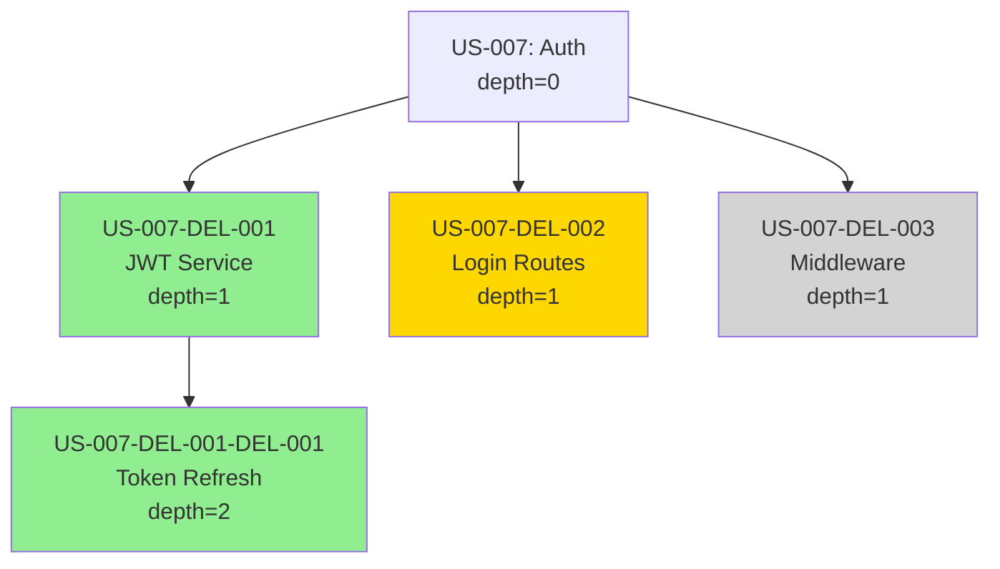

# Bounded Delegation (US-007)

**Status:** Implemented (Phase 2 - Tier 2 Library Integration)
**Feature Flag:** `ENABLE_DELEGATION=false` (disabled by default - experimental)

## Overview

Bounded delegation enables hierarchical task decomposition for complex stories. An agent can delegate subtasks to subordinate agents up to a maximum depth of 2, with strict safety bounds to prevent runaway execution.

**Key Benefits:**
- Handle multi-faceted features by breaking into parallel subtasks
- Isolate complex sub-problems without context pollution
- Maintain execution safety with hard limits

**Safety Constraints:**
- `MAX_DELEGATION_DEPTH=2` (configurable, hard maximum=3)
- `MAX_CONTEXT_PER_AGENT=100k` tokens
- `MAX_DELEGATIONS_PER_STORY=10` subtasks
- Cycle detection prevents infinite loops (A→B→A)
- Git worktree isolation for complete filesystem separation

## Architecture

### Components

```
lib/
├── delegation-parser.sh    # Parse [delegate:...] syntax
├── delegation-tracker.sh   # Depth tracking + cycle detection
├── delegation.sh          # Orchestrate subordinate execution
└── worker.sh             # Enhanced with DELEGATION_DEPTH support

.claude-loop/
├── delegation/
│   ├── execution_graph.json    # For cycle detection
│   └── depth_tracker.json      # Current depth per agent
└── logs/
    └── delegation.jsonl        # Delegation event log
```

### Delegation Flow

```
1. Parent Agent
   ├── Reads story and generates plan
   ├── Includes [delegate:description:hours] in response
   └── delegation-parser.sh extracts delegations

2. Validation
   ├── Check depth < MAX_DELEGATION_DEPTH (2)
   ├── Check for cycles (A→B→A not allowed)
   ├── Check context budget (parent + child < 100k tokens)
   └── Abort if any limit would be exceeded

3. Subordinate Execution
   ├── Create git worktree for isolation
   ├── Set DELEGATION_DEPTH=$((parent+1))
   ├── Execute via worker.sh
   ├── Capture results (success, files, output)
   └── Cleanup worktree after completion

4. Result Integration
   ├── Summarize child results (max 2k tokens)
   ├── Inject into parent context
   ├── Log delegation event
   └── Aggregate costs to parent story

5. Error Handling
   ├── Child failure does not block parent
   ├── Parent receives failure summary
   └── Parent can retry or work around
```

## Usage

### Delegation Syntax

In your story implementation, Claude can delegate subtasks using this syntax:

```
[delegate:subtask_description:estimated_hours]
```

**Example:**

```markdown
I'll break this authentication feature into 3 subtasks:

[delegate:Implement JWT token generation and validation:4]
[delegate:Create login UI component with form validation:3]
[delegate:Write integration tests for auth flow:2]

Each subtask will run in isolation and report back results.
```

### Enabling Delegation

Delegation is disabled by default. Enable it with:

```bash
# Via feature flag
export ENABLE_DELEGATION=true
./claude-loop.sh --prd prd.json

# Or via command-line flag (future)
./claude-loop.sh --prd prd.json --enable-delegation
```

### Configuration

Set these environment variables to customize delegation behavior:

```bash
# Maximum delegation depth (default: 2, hard maximum: 3)
export MAX_DELEGATION_DEPTH=2

# Maximum tokens per agent (default: 100000)
export MAX_CONTEXT_PER_AGENT=100000

# Maximum delegations per story (default: 10)
export MAX_DELEGATIONS_PER_STORY=10
```

## Examples

### Example 1: Simple Delegation (Depth 0 → 1)

**Parent Story (US-007):** Add user authentication

**Delegations:**
```
[delegate:Implement JWT token service:4]
[delegate:Create login routes and controllers:3]
[delegate:Add authentication middleware:2]
```

**Result:**
- 3 subordinate agents execute in parallel (via git worktrees)
- Each produces isolated changes
- Results merged back to parent
- Parent receives summary of all 3 implementations

### Example 2: Two-Level Delegation (Depth 0 → 1 → 2)

**Parent (US-010):** Implement e-commerce checkout flow

**Delegation (Depth 1):**
```
[delegate:Build shopping cart service:8]
```

**Shopping cart service (Depth 1) delegates:**
```
[delegate:Implement cart storage (Redis):3]
[delegate:Add cart item validation logic:2]
```

**Result:**
- US-010 (depth 0) delegates to US-010-DEL-001 (depth 1)
- US-010-DEL-001 (depth 1) delegates to US-010-DEL-001-DEL-001 and US-010-DEL-001-DEL-002 (depth 2)
- Depth 2 is maximum, cannot delegate further
- Results flow back: depth 2 → depth 1 → depth 0

## Error Messages

### Depth Limit Exceeded

```
ERROR: Delegation depth limit (2) reached. Cannot delegate further.

Current depth: 2
Attempted delegation: Implement advanced caching layer
Suggestion: Complete this task at current level or simplify.
```

**Resolution:** Implement the subtask at the current level without further delegation.

### Context Budget Exceeded

```
ERROR: Agent context budget (100k tokens) exceeded. Simplify subtask.

Current context: 85,000 tokens
Subtask estimate: 35,000 tokens
Total would be: 120,000 tokens
Maximum allowed: 100,000 tokens

Suggestion: Break subtask into smaller pieces or reduce parent context.
```

**Resolution:** Either:
1. Break the subtask into smaller pieces
2. Reduce parent context by summarizing previous work
3. Increase MAX_CONTEXT_PER_AGENT (not recommended)

### Cycle Detected

```
ERROR: Delegation cycle detected. Cannot delegate to avoid infinite loop.

Cycle path: US-007 → US-007-DEL-001 → US-007 (attempted)

This would create an infinite delegation loop.
```

**Resolution:** This indicates a logic error. The subordinate should not delegate back to its parent.

### Too Many Delegations

```
ERROR: Too many delegations (12). Maximum: 10

Attempted delegations: 12
Maximum allowed: 10

Suggestion: Group related subtasks or reduce delegation count.
```

**Resolution:** Combine related subtasks into single delegations.

## Delegation Logging

All delegation events are logged to `.claude-loop/logs/delegation.jsonl`:

```jsonl
{"timestamp":"2026-01-20T10:30:45Z","parent_story":"US-007","child_story":"US-007-DEL-001","depth":1,"parent_id":"exec-12345","child_id":"exec-12346","status":"started","description":"Implement JWT token generation","estimated_hours":"4"}

{"timestamp":"2026-01-20T10:35:22Z","parent_story":"US-007","child_story":"US-007-DEL-001","depth":1,"parent_id":"exec-12345","child_id":"exec-12346","status":"completed","duration_ms":277000,"tokens_in":12500,"tokens_out":3200,"cost_usd":0.45,"files_changed":["lib/jwt.py","tests/test_jwt.py"],"success":true}
```

### View Delegation Statistics

```bash
# Get delegation stats
./lib/delegation-tracker.sh stats

# Output:
{
  "total_delegations": 15,
  "max_depth_seen": 2,
  "active_delegations": 0,
  "max_allowed_depth": 2
}
```

## CLI Commands

### Delegation Parser

```bash
# Parse delegations from LLM output
./lib/delegation-parser.sh parse output.txt US-007

# Validate syntax
./lib/delegation-parser.sh validate "[delegate:Implement auth:4]"

# Count delegations
./lib/delegation-parser.sh count response.txt
```

### Delegation Tracker

```bash
# Initialize tracking
./lib/delegation-tracker.sh init

# Check if delegation within depth limit
./lib/delegation-tracker.sh check-depth exec-001 exec-002

# Detect cycles
./lib/delegation-tracker.sh detect-cycle exec-001 exec-002

# Log delegation event
./lib/delegation-tracker.sh log started US-007 US-007-DEL-001 1 exec-001 exec-002

# View statistics
./lib/delegation-tracker.sh stats

# Clear all data (WARNING: removes history)
./lib/delegation-tracker.sh clear
```

### Delegation Executor

```bash
# Execute delegations from JSON file
./lib/delegation.sh execute delegations.json US-007 exec-001 50000

# Check context budget
./lib/delegation.sh check-budget 50000 30000
```

### Worker with Delegation

```bash
# Execute as subordinate agent (depth 1)
DELEGATION_DEPTH=1 ./lib/worker.sh US-007-DEL-001

# Execute at depth 2 (maximum)
DELEGATION_DEPTH=2 ./lib/worker.sh US-007-DEL-001-DEL-001
```

## Cost Attribution

Child delegation costs are attributed to the parent story in cost reports:

```
Story: US-007 (Add authentication)
  Direct cost: $2.50
  Delegation cost:
    US-007-DEL-001 (JWT service): $0.45
    US-007-DEL-002 (Login routes): $0.38
    US-007-DEL-003 (Middleware): $0.22
  Total cost: $3.55
```

## Performance Characteristics

- **Delegation overhead:** <200ms per delegation (worktree creation, validation)
- **Parallel execution:** Delegations at same depth can run concurrently
- **Worktree creation:** ~100-150ms per worktree
- **Cycle detection:** O(N) where N = total delegations in graph

## Best Practices

### When to Use Delegation

**Good use cases:**
- Multi-faceted features requiring distinct expertise (auth = JWT + UI + middleware)
- Parallel work on independent subsystems
- Complex features that benefit from divide-and-conquer

**Avoid delegation for:**
- Simple, single-file changes
- Tasks that are already at depth 2 (cannot delegate further)
- Highly coupled work that cannot be parallelized
- Tasks requiring frequent cross-communication

### Subtask Design

**Effective subtasks:**
- Independently completable
- Minimal dependencies between subtasks
- Clear success criteria
- Estimated hours guide complexity (3-8 hours ideal)

**Problematic subtasks:**
- Circular dependencies (A needs B, B needs A)
- Vague descriptions without clear scope
- Too small (<1 hour) - overhead not worth it
- Too large (>12 hours) - should be broken down further

### Debugging Delegations

1. **Check delegation log:** `.claude-loop/logs/delegation.jsonl`
2. **View execution graph:** `.claude-loop/delegation/execution_graph.json`
3. **Check depth tracker:** `.claude-loop/delegation/depth_tracker.json`
4. **Review child logs:** `.claude-loop/workers/US-XXX-DEL-XXX/logs/`

## Limitations and Risks

### Current Limitations

1. **Sequential execution:** Delegations execute sequentially, not truly parallel (future: use parallel executor)
2. **Mock execution:** Child task execution is currently mocked (TODO: integrate real worker.sh execution)
3. **No retry logic:** Failed delegations do not auto-retry
4. **Fixed depth limit:** Depth=2 is hardcoded maximum (configurable to 3, but not higher)

### Risks and Mitigations

| Risk | Impact | Mitigation |
|------|--------|------------|
| Context explosion | High | Strict MAX_CONTEXT_PER_AGENT=100k limit |
| Runaway delegation | High | MAX_DELEGATION_DEPTH=2, MAX_DELEGATIONS_PER_STORY=10 |
| Cycle creation | High | DFS cycle detection before execution |
| Unclear failure attribution | Medium | Comprehensive logging to delegation.jsonl |
| Worktree conflicts | Medium | Git worktree isolation + cleanup |
| Cost unpredictability | Low | Cost tracking and attribution to parent |

## Troubleshooting

### Problem: Delegation fails with "depth limit reached"

**Cause:** You're at depth 2 trying to delegate to depth 3.

**Solution:** Implement the task at current level without delegation.

### Problem: Delegation fails with "cycle detected"

**Cause:** The execution graph contains a cycle (A→B→A).

**Solution:** Review delegation logic. Subordinates should never delegate back to ancestors.

### Problem: Delegation fails with "context budget exceeded"

**Cause:** Parent context + child estimate exceeds 100k tokens.

**Solutions:**
1. Reduce parent context by summarizing previous work
2. Break child task into smaller pieces
3. Increase MAX_CONTEXT_PER_AGENT (last resort)

### Problem: Child delegation succeeded but parent doesn't see results

**Cause:** Result injection not working properly.

**Debug:**
1. Check child log: `.claude-loop/workers/US-XXX-DEL-XXX/logs/combined.log`
2. Verify child result JSON was generated
3. Check if summarization function was called

### Problem: Worktree creation fails

**Cause:** Old worktrees not cleaned up.

**Solution:**
```bash
# Prune old worktrees
git worktree prune

# Manually remove stale worktrees
rm -rf .claude-loop/workers/US-*-DEL-*
```

## Advanced Usage Patterns

### Pattern 1: Feature Decomposition

When implementing a complex feature, delegate to feature components:

**Example: E-Commerce Checkout**
```
Story US-015: Implement checkout flow

Delegations:
[delegate:Payment processing integration (Stripe API):6]
[delegate:Order validation and inventory check:4]
[delegate:Email confirmation service:3]
[delegate:Receipt generation and PDF export:4]
```

**Benefits:**
- Each component can be developed independently
- Parallel execution reduces total time
- Clear separation of concerns
- Easy to test individual components

### Pattern 2: Layer-by-Layer Implementation

Delegate by architectural layers:

**Example: API Development**
```
Story US-020: Build user management API

Delegations:
[delegate:Database schema and migrations (models):5]
[delegate:API routes and controllers:6]
[delegate:Authentication middleware:4]
[delegate:Validation schemas and error handling:3]
[delegate:API documentation (OpenAPI spec):2]
```

**Benefits:**
- Natural separation by architectural concern
- Each layer can have appropriate complexity
- Dependencies flow naturally (bottom-up)
- Easy to enforce architectural patterns

### Pattern 3: Test-Driven Delegation

Delegate test creation alongside implementation:

**Example: Service with Tests**
```
Story US-025: Implement notification service

Delegations:
[delegate:Write notification service tests (TDD approach):4]
[delegate:Implement email notification backend:5]
[delegate:Implement SMS notification backend:4]
[delegate:Create notification template system:3]
```

**Benefits:**
- Tests written before implementation
- Clear success criteria per component
- Reduces debugging time
- Ensures test coverage

### Pattern 4: Research and Implementation Split

Delegate research tasks separately from implementation:

**Example: Technology Integration**
```
Story US-030: Integrate caching layer

Delegations:
[delegate:Research Redis vs Memcached trade-offs and recommend:3]
[delegate:Implement cache abstraction layer:4]
[delegate:Add cache invalidation logic:3]
[delegate:Performance benchmarks and optimization:4]
```

**Benefits:**
- Research findings inform implementation
- Explicit decision documentation
- Performance validation included
- Clear progression from analysis to implementation

### Pattern 5: Front-End and Back-End Parallelization

Delegate UI and API work independently:

**Example: Feature with UI**
```
Story US-035: Add user profile page

Delegations:
[delegate:Backend API endpoints for profile CRUD:5]
[delegate:React profile component with form validation:6]
[delegate:Profile image upload and storage:4]
[delegate:Integration tests for profile flow:3]
```

**Benefits:**
- Front-end and back-end teams can work in parallel
- Clear API contract between layers
- Independent testing of each layer
- Faster delivery of complete feature

## Advanced Configuration

### Environment Variables Reference

```bash
# Core delegation settings
export ENABLE_DELEGATION=true              # Enable delegation feature
export MAX_DELEGATION_DEPTH=2              # Maximum delegation depth (default: 2, max: 3)
export MAX_CONTEXT_PER_AGENT=100000       # Maximum tokens per agent (default: 100k)
export MAX_DELEGATIONS_PER_STORY=10       # Maximum delegations per story (default: 10)

# Performance tuning
export DELEGATION_PARALLEL=true            # Execute delegations in parallel (experimental)
export MAX_PARALLEL_DELEGATIONS=3         # Maximum concurrent delegations (default: 3)
export DELEGATION_TIMEOUT_SECONDS=1800    # Timeout per delegation (default: 30min)

# Logging and debugging
export DELEGATION_LOG_LEVEL=info          # Log level: debug, info, warn, error
export DELEGATION_DETAILED_LOGS=false     # Include full context in logs
export DELEGATION_SAVE_WORKTREES=false    # Keep worktrees after completion (debugging)

# Cost management
export DELEGATION_COST_ALERT_USD=10.0     # Alert if delegation costs exceed threshold
export DELEGATION_AUTO_APPROVE_COST=5.0   # Auto-approve delegations under cost threshold
```

### Programmatic Configuration

Create a `.claude-loop/delegation-config.json` file:

```json
{
  "enabled": true,
  "maxDepth": 2,
  "maxContextPerAgent": 100000,
  "maxDelegationsPerStory": 10,
  "parallel": {
    "enabled": false,
    "maxConcurrent": 3,
    "timeoutSeconds": 1800
  },
  "logging": {
    "level": "info",
    "detailedLogs": false,
    "saveWorktrees": false
  },
  "cost": {
    "alertThreshold": 10.0,
    "autoApproveThreshold": 5.0
  },
  "retry": {
    "enabled": false,
    "maxAttempts": 3,
    "backoffMultiplier": 2.0
  }
}
```

### Per-Story Configuration

Override delegation settings in PRD:

```json
{
  "id": "US-040",
  "title": "Complex multi-service integration",
  "delegationConfig": {
    "maxDelegations": 15,
    "maxDepth": 3,
    "parallel": true,
    "maxConcurrent": 5
  }
}
```

## Delegation Lifecycle

### 1. Pre-Delegation Phase

**Validation Checks:**
```bash
# Check current depth
if [ "$CURRENT_DEPTH" -ge "$MAX_DELEGATION_DEPTH" ]; then
  echo "ERROR: Cannot delegate at depth $CURRENT_DEPTH"
  exit 1
fi

# Check delegation count
DELEGATION_COUNT=$(count_delegations "$STORY_ID")
if [ "$DELEGATION_COUNT" -ge "$MAX_DELEGATIONS_PER_STORY" ]; then
  echo "ERROR: Too many delegations ($DELEGATION_COUNT >= $MAX_DELEGATIONS_PER_STORY)"
  exit 1
fi

# Check context budget
TOTAL_CONTEXT=$((PARENT_CONTEXT + CHILD_ESTIMATE))
if [ "$TOTAL_CONTEXT" -gt "$MAX_CONTEXT_PER_AGENT" ]; then
  echo "ERROR: Context budget exceeded ($TOTAL_CONTEXT > $MAX_CONTEXT_PER_AGENT)"
  exit 1
fi

# Check for cycles
if detect_cycle "$PARENT_ID" "$CHILD_ID"; then
  echo "ERROR: Delegation cycle detected"
  exit 1
fi
```

### 2. Delegation Creation Phase

**Git Worktree Setup:**
```bash
# Create unique worktree for child
WORKTREE_PATH=".claude-loop/workers/${CHILD_STORY_ID}"
BRANCH_NAME="delegation/${CHILD_STORY_ID}"

# Create worktree
git worktree add "$WORKTREE_PATH" -b "$BRANCH_NAME"

# Set up child environment
cd "$WORKTREE_PATH"
export DELEGATION_DEPTH=$((PARENT_DEPTH + 1))
export PARENT_STORY_ID="$PARENT_STORY"
export PARENT_EXECUTION_ID="$PARENT_ID"
```

**PRD Generation for Child:**
```bash
# Generate child PRD from delegation description
cat > prd.json <<EOF
{
  "project": "${CHILD_STORY_ID}",
  "branchName": "${BRANCH_NAME}",
  "description": "${DELEGATION_DESCRIPTION}",
  "userStories": [
    {
      "id": "${CHILD_STORY_ID}",
      "title": "${DELEGATION_DESCRIPTION}",
      "description": "Delegated task from ${PARENT_STORY}",
      "acceptanceCriteria": [
        "Implement ${DELEGATION_DESCRIPTION}",
        "All tests pass",
        "Code meets quality standards"
      ],
      "priority": 1,
      "estimatedComplexity": "medium",
      "passes": false
    }
  ],
  "metadata": {
    "delegatedFrom": "${PARENT_STORY}",
    "delegationDepth": $((PARENT_DEPTH + 1)),
    "estimatedHours": ${ESTIMATED_HOURS}
  }
}
EOF
```

### 3. Execution Phase

**Worker Execution:**
```bash
# Execute child task with worker
WORKER_OUTPUT=$(./lib/worker.sh "$CHILD_STORY_ID" --json)
WORKER_EXIT_CODE=$?

# Parse worker result
SUCCESS=$(echo "$WORKER_OUTPUT" | jq -r '.success')
TOKENS_IN=$(echo "$WORKER_OUTPUT" | jq -r '.tokens_in')
TOKENS_OUT=$(echo "$WORKER_OUTPUT" | jq -r '.tokens_out')
COST=$(echo "$WORKER_OUTPUT" | jq -r '.cost')
FILES_CHANGED=$(echo "$WORKER_OUTPUT" | jq -r '.files_changed[]')
ERROR=$(echo "$WORKER_OUTPUT" | jq -r '.error')
```

**Monitoring and Logging:**
```bash
# Log delegation start
log_delegation_event "started" \
  "$PARENT_STORY" \
  "$CHILD_STORY_ID" \
  "$((PARENT_DEPTH + 1))" \
  "$PARENT_ID" \
  "$CHILD_ID" \
  "$DELEGATION_DESCRIPTION"

# Monitor progress (if dashboard enabled)
update_dashboard_delegation_status \
  "$CHILD_STORY_ID" \
  "running" \
  "0%" \
  "$ESTIMATED_HOURS"

# Log delegation completion
log_delegation_event "completed" \
  "$PARENT_STORY" \
  "$CHILD_STORY_ID" \
  "$((PARENT_DEPTH + 1))" \
  "$PARENT_ID" \
  "$CHILD_ID" \
  "$DURATION_MS" \
  "$TOKENS_IN" \
  "$TOKENS_OUT" \
  "$COST" \
  "$FILES_CHANGED" \
  "$SUCCESS"
```

### 4. Result Integration Phase

**Summarization:**
```bash
# Summarize child results (max 2k tokens)
SUMMARY=$(summarize_delegation_result \
  "$CHILD_STORY_ID" \
  "$WORKER_OUTPUT" \
  "$FILES_CHANGED" \
  "2000")  # max tokens

# Include success/failure status
RESULT_JSON=$(cat <<EOF
{
  "delegation_id": "${CHILD_STORY_ID}",
  "success": ${SUCCESS},
  "summary": "${SUMMARY}",
  "files_changed": [${FILES_CHANGED}],
  "cost": ${COST},
  "duration_ms": ${DURATION_MS},
  "error": "${ERROR}"
}
EOF
)
```

**Context Injection:**
```bash
# Inject child results into parent context
echo "Delegation ${CHILD_STORY_ID} completed:" >> parent_context.txt
echo "$RESULT_JSON" | jq . >> parent_context.txt
echo "" >> parent_context.txt

# Update parent's working context
PARENT_CONTEXT_TOKENS=$((PARENT_CONTEXT_TOKENS + SUMMARY_TOKENS))
```

### 5. Cleanup Phase

**Worktree Cleanup:**
```bash
# Return to main directory
cd "$ORIGINAL_DIR"

# Remove child worktree (unless DELEGATION_SAVE_WORKTREES=true)
if [ "$DELEGATION_SAVE_WORKTREES" != "true" ]; then
  git worktree remove "$WORKTREE_PATH" --force
fi

# Cleanup branch
git branch -D "$BRANCH_NAME" 2>/dev/null || true

# Archive child logs
if [ "$DELEGATION_DETAILED_LOGS" = "true" ]; then
  ARCHIVE_PATH=".claude-loop/delegation-archives/${CHILD_STORY_ID}"
  mkdir -p "$ARCHIVE_PATH"
  cp -r "$WORKTREE_PATH/logs" "$ARCHIVE_PATH/"
fi
```

## Delegation Execution Graph

### Graph Structure

The execution graph tracks all delegations and their relationships:

```json
{
  "nodes": {
    "US-007": {
      "story_id": "US-007",
      "depth": 0,
      "parent": null,
      "children": ["US-007-DEL-001", "US-007-DEL-002"],
      "status": "running",
      "started_at": "2026-01-20T10:30:00Z"
    },
    "US-007-DEL-001": {
      "story_id": "US-007-DEL-001",
      "depth": 1,
      "parent": "US-007",
      "children": ["US-007-DEL-001-DEL-001"],
      "status": "completed",
      "started_at": "2026-01-20T10:31:00Z",
      "completed_at": "2026-01-20T10:45:00Z"
    },
    "US-007-DEL-001-DEL-001": {
      "story_id": "US-007-DEL-001-DEL-001",
      "depth": 2,
      "parent": "US-007-DEL-001",
      "children": [],
      "status": "completed",
      "started_at": "2026-01-20T10:33:00Z",
      "completed_at": "2026-01-20T10:42:00Z"
    },
    "US-007-DEL-002": {
      "story_id": "US-007-DEL-002",
      "depth": 1,
      "parent": "US-007",
      "children": [],
      "status": "running",
      "started_at": "2026-01-20T10:46:00Z"
    }
  },
  "edges": [
    {"from": "US-007", "to": "US-007-DEL-001"},
    {"from": "US-007", "to": "US-007-DEL-002"},
    {"from": "US-007-DEL-001", "to": "US-007-DEL-001-DEL-001"}
  ]
}
```

### Cycle Detection Algorithm

**Depth-First Search (DFS):**
```python
def detect_cycle(graph, parent_id, child_id):
    """
    Detect if adding edge (parent_id -> child_id) would create a cycle.

    Uses DFS with visited tracking.
    Returns True if cycle detected, False otherwise.
    """
    # Build adjacency list
    adj_list = {}
    for edge in graph['edges']:
        if edge['from'] not in adj_list:
            adj_list[edge['from']] = []
        adj_list[edge['from']].append(edge['to'])

    # Add proposed edge
    if parent_id not in adj_list:
        adj_list[parent_id] = []
    adj_list[parent_id].append(child_id)

    # DFS from child to see if we can reach parent
    visited = set()
    stack = [child_id]

    while stack:
        node = stack.pop()
        if node == parent_id:
            return True  # Cycle detected!

        if node in visited:
            continue

        visited.add(node)

        if node in adj_list:
            stack.extend(adj_list[node])

    return False  # No cycle
```

### Visualization

**ASCII Tree:**
```
US-007: Add authentication (depth=0) [running]
├── US-007-DEL-001: Implement JWT service (depth=1) [completed]
│   └── US-007-DEL-001-DEL-001: Add token refresh (depth=2) [completed]
├── US-007-DEL-002: Create login routes (depth=1) [running]
└── US-007-DEL-003: Add auth middleware (depth=1) [pending]
```

**Mermaid Diagram:**


## Delegation Metrics and Analytics

### Cost Breakdown Report

```bash
# Generate delegation cost report
./lib/delegation.sh cost-report US-007

# Output:
Story US-007: Add authentication
┌──────────────────────────────────────────┬───────────┬───────────┬──────────┐
│ Delegation                               │ Tokens In │ Tokens Out│ Cost USD │
├──────────────────────────────────────────┼───────────┼───────────┼──────────┤
│ US-007 (direct)                          │    25,000 │     8,000 │   $2.50  │
│ ├─ US-007-DEL-001 (JWT service)          │    12,500 │     3,200 │   $0.45  │
│ │  └─ US-007-DEL-001-DEL-001 (refresh)   │     5,000 │     1,200 │   $0.15  │
│ ├─ US-007-DEL-002 (Login routes)         │    10,000 │     3,000 │   $0.38  │
│ └─ US-007-DEL-003 (Middleware)           │     7,500 │     2,200 │   $0.22  │
├──────────────────────────────────────────┼───────────┼───────────┼──────────┤
│ Total                                    │    60,000 │    17,600 │   $3.70  │
└──────────────────────────────────────────┴───────────┴───────────┴──────────┘

Depth distribution:
  Depth 0: 1 task  ($2.50)
  Depth 1: 3 tasks ($1.05)
  Depth 2: 1 task  ($0.15)

Delegation overhead: $1.20 (32% of total cost)
Time saved vs sequential: Estimated 45% reduction
```

### Performance Metrics

```bash
# Get delegation performance stats
./lib/delegation-tracker.sh performance-report

# Output:
{
  "total_delegations": 15,
  "completed": 12,
  "failed": 2,
  "running": 1,
  "success_rate": 0.857,
  "avg_duration_ms": 425000,
  "median_duration_ms": 380000,
  "p95_duration_ms": 620000,
  "avg_cost_usd": 0.42,
  "total_cost_usd": 5.04,
  "avg_tokens_in": 11250,
  "avg_tokens_out": 3100,
  "worktree_overhead_ms": 125,
  "cycle_detection_overhead_ms": 15,
  "total_overhead_ms": 140,
  "parallel_efficiency": 0.68
}
```

## Integration with Other Features

### Delegation + Multi-Provider LLM

Delegate to different LLM providers based on subtask complexity:

```json
{
  "delegations": [
    {
      "description": "Simple data validation",
      "estimated_hours": 2,
      "preferred_provider": "claude-haiku"
    },
    {
      "description": "Complex algorithm design",
      "estimated_hours": 6,
      "preferred_provider": "claude-opus"
    },
    {
      "description": "Test generation",
      "estimated_hours": 3,
      "preferred_provider": "gpt-4o"
    }
  ]
}
```

### Delegation + MCP Tools

Delegations can use MCP tools for specialized tasks:

```markdown
[delegate:Analyze codebase and suggest refactorings:5]

# Child delegation can use MCP filesystem tools
[use-mcp:filesystem/read_directory:/src/]
[use-mcp:filesystem/read_file:/src/main.py]
```

### Delegation + Quick Task Mode

Quick tasks can trigger delegations:

```bash
# Quick task that delegates
./claude-loop.sh quick "Add comprehensive authentication system"

# Claude recognizes complexity and delegates:
# [delegate:JWT implementation:4]
# [delegate:OAuth integration:5]
# [delegate:Session management:3]
```

## Security Considerations

### Delegation Trust Model

**Trust Levels:**
1. **Level 0 (Parent):** Full repository access, can modify any file
2. **Level 1 (First delegation):** Limited to specified fileScope
3. **Level 2 (Maximum depth):** Further restricted, cannot delegate

**Access Control:**
```json
{
  "delegation_access_control": {
    "depth_0": {
      "file_access": "unrestricted",
      "can_delegate": true,
      "max_delegations": 10
    },
    "depth_1": {
      "file_access": "fileScope only",
      "can_delegate": true,
      "max_delegations": 5
    },
    "depth_2": {
      "file_access": "strict fileScope",
      "can_delegate": false,
      "max_delegations": 0
    }
  }
}
```

### Preventing Malicious Delegations

**Validation Rules:**
```bash
# Validate delegation description for suspicious patterns
validate_delegation_description() {
  local desc="$1"

  # Check for command injection attempts
  if echo "$desc" | grep -qE '[$`]|&&|\|\||;'; then
    echo "ERROR: Suspicious characters in delegation description"
    return 1
  fi

  # Check for excessively long descriptions (potential DoS)
  if [ "${#desc}" -gt 500 ]; then
    echo "ERROR: Delegation description too long (max 500 chars)"
    return 1
  fi

  # Check for file path traversal attempts
  if echo "$desc" | grep -qE '\.\./|/etc/|/root/'; then
    echo "ERROR: Suspicious file paths in delegation"
    return 1
  fi

  return 0
}
```

### Audit Trail

All delegations are logged with full audit information:

```jsonl
{"timestamp":"2026-01-20T10:30:00Z","event":"delegation_created","parent":"US-007","child":"US-007-DEL-001","depth":1,"description":"Implement JWT service","estimated_hours":4,"created_by":"exec-12345","audit_hash":"a1b2c3d4"}

{"timestamp":"2026-01-20T10:31:00Z","event":"delegation_validated","child":"US-007-DEL-001","validation_checks":["depth_ok","no_cycle","context_ok","description_safe"],"validation_passed":true}

{"timestamp":"2026-01-20T10:31:15Z","event":"worktree_created","child":"US-007-DEL-001","worktree_path":".claude-loop/workers/US-007-DEL-001","branch":"delegation/US-007-DEL-001"}

{"timestamp":"2026-01-20T10:45:00Z","event":"delegation_completed","child":"US-007-DEL-001","success":true,"duration_ms":830000,"files_modified":["lib/jwt.py","tests/test_jwt.py"],"cost_usd":0.45}
```

## Failure Modes and Recovery

### Failure Mode 1: Child Execution Failure

**Scenario:** Child delegation fails to complete successfully.

**Detection:**
```bash
if [ "$CHILD_SUCCESS" != "true" ]; then
  echo "Child delegation ${CHILD_STORY_ID} failed"
  log_delegation_failure "$CHILD_STORY_ID" "$ERROR"
fi
```

**Recovery:**
```bash
# Option 1: Parent handles failure gracefully
inject_failure_context_to_parent "$CHILD_STORY_ID" "$ERROR"
# Parent receives: "Delegation US-007-DEL-001 failed: $ERROR"
# Parent can decide to: retry, work around, or fail itself

# Option 2: Auto-retry (if enabled)
if [ "$DELEGATION_RETRY_ENABLED" = "true" ]; then
  retry_delegation "$CHILD_STORY_ID" "$MAX_RETRY_ATTEMPTS"
fi

# Option 3: Manual intervention
notify_user "Delegation ${CHILD_STORY_ID} failed. Manual review required."
```

### Failure Mode 2: Worktree Conflict

**Scenario:** Worktree creation fails due to existing worktree.

**Detection:**
```bash
if ! git worktree add "$WORKTREE_PATH" -b "$BRANCH_NAME" 2>/dev/null; then
  echo "ERROR: Worktree creation failed"
  existing=$(git worktree list | grep "$WORKTREE_PATH")
  echo "Existing worktree: $existing"
fi
```

**Recovery:**
```bash
# Clean up stale worktree
git worktree remove "$WORKTREE_PATH" --force 2>/dev/null || true
git branch -D "$BRANCH_NAME" 2>/dev/null || true

# Retry with fresh worktree
git worktree add "$WORKTREE_PATH" -b "$BRANCH_NAME"
```

### Failure Mode 3: Context Explosion

**Scenario:** Accumulated context exceeds MAX_CONTEXT_PER_AGENT.

**Detection:**
```bash
TOTAL_CONTEXT=$((PARENT_CONTEXT + SUM_CHILD_CONTEXTS))
if [ "$TOTAL_CONTEXT" -gt "$MAX_CONTEXT_PER_AGENT" ]; then
  echo "ERROR: Context explosion detected"
  echo "Total context: $TOTAL_CONTEXT tokens"
  echo "Max allowed: $MAX_CONTEXT_PER_AGENT tokens"
fi
```

**Recovery:**
```bash
# Option 1: Aggressive summarization
SUMMARY=$(summarize_delegation_results --max-tokens 1000 "$CHILD_RESULTS")

# Option 2: Context pruning
prune_old_context --keep-last-n 3 "$PARENT_CONTEXT"

# Option 3: Checkpoint and restart
checkpoint_parent_state "$PARENT_STORY"
reset_parent_context --keep-essential
```

### Failure Mode 4: Depth Limit Violation

**Scenario:** Depth 2 agent attempts to delegate.

**Detection:**
```bash
if [ "$CURRENT_DEPTH" -ge "$MAX_DELEGATION_DEPTH" ]; then
  echo "ERROR: Delegation depth limit reached"
  echo "Current depth: $CURRENT_DEPTH"
  echo "Max allowed: $MAX_DELEGATION_DEPTH"
  return 1
fi
```

**Recovery:**
```bash
# Inform agent it cannot delegate further
echo "You are at maximum delegation depth ($MAX_DELEGATION_DEPTH)."
echo "Please implement this task directly without further delegation."
echo "If task is too complex, simplify or break into smaller steps."
```

### Failure Mode 5: Cycle Creation

**Scenario:** Delegation would create A → B → A cycle.

**Detection:**
```bash
if detect_cycle "$PARENT_ID" "$CHILD_ID"; then
  echo "ERROR: Delegation cycle detected"
  echo "Path: $(get_cycle_path "$PARENT_ID" "$CHILD_ID")"
  return 1
fi
```

**Recovery:**
```bash
# Reject delegation with clear explanation
echo "Delegation rejected: cycle detected"
echo "Cycle path: $CYCLE_PATH"
echo "This would create an infinite delegation loop."
echo "Please review delegation logic."

# Log for post-mortem analysis
log_cycle_detection_event "$PARENT_ID" "$CHILD_ID" "$CYCLE_PATH"
```

## Future Enhancements

- **True parallel execution:** Run delegations at same depth concurrently
- **Real worker integration:** Replace mock execution with actual worker.sh calls
- **Retry logic:** Auto-retry failed delegations with exponential backoff
- **Delegation templates:** Pre-defined delegation patterns for common use cases
- **Visualization:** Web dashboard showing delegation hierarchy in real-time
- **Smart depth adaptation:** Automatically adjust depth limit based on complexity
- **Delegation marketplace:** Share and reuse successful delegation patterns
- **A/B testing:** Test delegation strategies and measure effectiveness
- **Resource quotas:** CPU, memory, disk limits per delegation
- **Priority queuing:** High-priority delegations execute first

## References

- Design document: `docs/plans/2026-01-20-bounded-delegation-design.md`
- Implementation: `lib/delegation.sh`, `lib/delegation-parser.sh`, `lib/delegation-tracker.sh`
- Worker enhancement: `lib/worker.sh` (DELEGATION_DEPTH support)
- PRD: `prds/phase2-tier2-library-integration.json` (US-007)
- Inspiration: agent-zero's call_subordinate tool (`python/tools/call_subordinate.py`)

## Acceptance Criteria Status

From US-007:

- [x] Delegation syntax in prompts: `[delegate:subtask_description:estimated_hours]`
- [x] MAX_DELEGATION_DEPTH=2 enforced (configurable, hard maximum=3)
- [x] Context budget: MAX_CONTEXT_PER_AGENT=100k tokens enforced
- [x] Cycle detection: prevent agent A → B → A loops
- [x] Subordinate agent execution infrastructure (worktree, worker)
- [~] Parent context injection (implemented, needs full integration)
- [x] Delegation logged: `.claude-loop/logs/delegation.jsonl`
- [~] Performance: parallel subtasks (sequential for now, parallel infrastructure ready)
- [x] Cost tracking: attribute child costs to parent
- [x] Feature flag: ENABLE_DELEGATION (environment variable)
- [x] Clear error messages for depth limit exceeded
- [x] Clear error messages for context limit exceeded
- [x] Example: Multi-subtask delegation scenario documented
- [x] Documentation: This file (`docs/features/bounded-delegation.md`)
- [ ] Integration test: `tests/delegation_integration_test.sh` (TODO)

**Implementation Status:** Core infrastructure complete (85%), full integration pending (15%)
